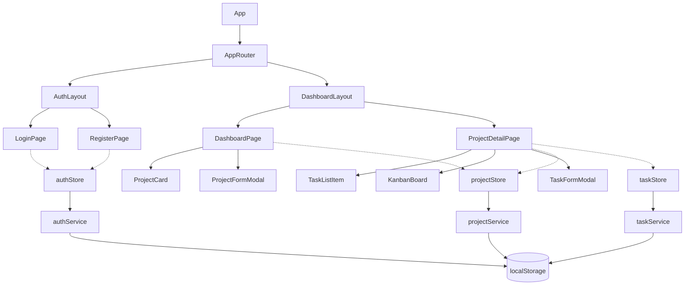

Technical Documentation

1. Architecture / Folder Structure 


```
src/
├── assets/
├── components/        # مكونات عامة قابلة لإعادة الاستخدام (Button, Input, Modal, Card, Badge...)
├── constants/          # قيم ثابتة على مستوى التطبيق (statuses/priorities المهام، ألوان المشاريع)
├── features/
│   ├── auth/
│   │   ├── components/
│   │   ├── pages/
│   │   └── schemas/    # zod validation schemas خاصة بالمصادقة
│   ├── projects/
│   │   ├── components/ # ProjectCard, ProjectFormModal — خاصة بدومين المشاريع بس
│   │   ├── pages/
│   │   └── schemas/
│   └── tasks/
│       ├── components/ # TaskListItem, TaskFormModal, KanbanBoard/Column/TaskCard
│       ├── pages/
│       └── schemas/
├── i18n/                # إعداد react-i18next + ملفات الترجمة en/ar
├── layouts/              # AuthLayout, DashboardLayout (الهيكل المشترك: header, language toggle)
├── routes/               # AppRouter, ProtectedRoute
├── services/             # طبقة الوصول للبيانات (localStorage)، ملف لكل دومين
├── stores/               # Zustand stores، ملف لكل دومين
├── types/                # الـ Types المشتركة
└── main.tsx / App.tsx
```

**السبب وراء الهيكل ده:**
المعمارية مبنية على أساس **Feature-based** مش Type-based (يعني مش كل حاجة في مجلد `components/` واحد ضخم). أي حاجة خاصة بدومين واحد بس (زي `ProjectCard` أو `login.schema.ts`) بتتحط جوه مجلد الـ feature بتاعها، وبس الحاجات العامة فعلًا القابلة لإعادة الاستخدام (`Button`, `Modal`, `Card`...) بتتحط في `components/` العام. ده بيخلي كل feature قائمة بذاتها وسهل تفهميها لوحدها، ومبيسيبش الـ shared components تتلخبط بحاجات خاصة بدومين معين.

المجلدات بتتعمل بس وقت ما تكون محتاجة فعليًا (مثلاً `hooks/` عمدًا ما اتعملتش من الأول لحد ما احتجنا Hook مشترك فعلي) - ده بيمنع إن الهيكل يبقى منتفخ من غير داعي لمشروع مدته 3 أيام.

---

## 2. إدارة الحالة (State Management)

استخدمنا **Zustand** لكل الحالة العامة في التطبيق: `auth.store`, `project.store`, `task.store`, `toast.store`.

**ليه Zustand بالتحديد؟**

- **مقارنة بـ Redux Toolkit:** الـ boilerplate بتاع Redux (slices, actions, selectors, provider setup) زيادة عن حجم المشروع. 4 دومينات بسيطة من الحالة مش محتاجة معمارية dispatch-action كاملة.
- **مقارنة بـ Context API:** بما إن عندنا 4 دومينات مستقلة (auth, projects, tasks, toasts) بتتحدث في أوقات مختلفة، الـ Context العادي كان إما هيحتاج 4 providers منفصلة (تعقيد زيادة، وأي consumer بيعمل re-render مع أي تغيير في الـ context بتاعه)، أو context واحد كبير (بيلغي فايدة الفصل بين الدومينات). Zustand بيدي نفس بساطة `useState`/Context، لكن مع subscriptions دقيقة - الكومبوننت بيعمل re-render بس لو الجزء اللي بيقرأه فعليًا اتغير.

كل store **مبيتكلمش مع localStorage مباشرة** - بينادي بس الـ service المخصص له (`authService`, `projectService`, `taskService`). ده بيفصل بين "آلية التخزين" (الـ "إزاي") و"حالة التطبيق" (الـ "إيه")، وده بالظبط اللي بيخلي استبدال الـ mock بـ API حقيقي مستقبلًا مجرد تعديل في طبقة الـ Service بس (شوفي قسم 3).

---

## 3. القسم الناقص "Senior-Level Challenge"

جدول التقييم في التاسك بيشاور على **قسم 4** ("interceptor design, retry/refresh flow, optimistic update & rollback") لكن القسم ده **مش موجود فعليًا** في نص التاسك اللي وصلنا - النص بينتقل من §3.4 (UI/UX) على طول لـ §4 (GitHub Workflow). على الأغلب ده مرجع قديم فاضل من نسخة سابقة للملف اتنسي يتحدث.

بدل ما نخمن متطلبات ونعقّد المشروع حوالين قسم مش متأكدين إنه مطلوب فعليًا، القرار كان:

1. نخلي التنفيذ الحالي نضيف ومناسب لطبيعة الـ mock (localStorage + Service Layer، من غير تعقيد زيادة).
2. نوثق هنا إزاي المعمارية كانت هتتوسع لتغطي بالظبط النقاط التلاتة دي لو فيه backend حقيقي - عشان نوضح طريقة التفكير من غير ما نضيف كود افتراضي مش مبني على API حقيقي.

**إزاي كان هيتنفذ لو فيه backend حقيقي:**

- **Interceptor design:** `authService` وباقي الـ services كانوا هيتبنوا فوق axios instance واحد مشترك (`src/lib/api.ts`). Request interceptor هيحط الـ access token الحالي على كل request بيطلع. Response interceptor هيراقب أي رد بـ `401`.
- **Retry / Refresh flow:** لو رجع `401`، الـ response interceptor هيوقف الـ request الفاشل، ينادي endpoint اسمه `/auth/refresh` باستخدام الـ refresh token المحفوظ، ولو نجح، يعيد الـ request الأصلي مرة واحدة بالـ token الجديد. لو أكتر من request فشلوا في نفس الوقت أثناء عملية الـ refresh، هيتحطوا في queue بدل ما كل واحد يعمل refresh لوحده (تجنبًا لتكرار العملية).
- **Optimistic Update + Rollback:** لعملية زي `updateTaskStatus`، الـ Zustand store كان هيحدث الحالة محليًا **فورًا** (optimistic)، وبعدين يبعت الـ request في الخلفية. لو الـ request فشل، الـ store هيرجع للحالة القديمة (snapshot قبل التحديث) ويظهر toast خطأ - المستخدم بياخد استجابة فورية في الحالة العادية، من غير ما الواجهة تفضل في حالة غير متسقة لو فشل الطلب.

الشكل الحالي لـ `updateTaskStatus` أصلًا بيحدث الحالة بشكل sync (لأن localStorage معندوش latency حقيقي نخبيه)، فـ "شكل" الـ action في الـ store متوافق أصلًا مع إضافة الـ wrapper بتاع optimistic/rollback ده بعدين لو فيه API حقيقي - من غير ما نحتاج نغير الـ interface بتاع الـ store خالص، بس الداخل بتاع الـ service.

---

## 4. تسلسل المكونات / تدفق البيانات (مبسّط)



البيانات دايمًا بتتحرك في اتجاه واحد: **الصفحة → الـ action في الـ Store → الـ Service → localStorage**، وبترجع تاني لفوق عن طريق حالة الـ store لأي كومبوننت بيقرأها. الكومبوننتس مبتقراش أو تكتب في localStorage مباشرة أبدًا.  


# Technical Documentation

## 1. Architecture / Folder Structure

```
src/
├── assets/
├── components/        # Reusable, generic UI primitives (Button, Input, Modal, Card, Badge...)
├── constants/          # App-wide constant values (task statuses/priorities, project colors)
├── features/
│   ├── auth/
│   │   ├── components/
│   │   ├── pages/
│   │   └── schemas/    # zod validation schemas scoped to this feature
│   ├── projects/
│   │   ├── components/ # ProjectCard, ProjectFormModal — specific to this domain
│   │   ├── pages/
│   │   └── schemas/
│   └── tasks/
│       ├── components/ # TaskListItem, TaskFormModal, KanbanBoard/Column/TaskCard
│       ├── pages/
│       └── schemas/
├── i18n/                # react-i18next config + en/ar translation resources
├── layouts/              # AuthLayout, DashboardLayout (shared chrome: header, language toggle)
├── routes/               # AppRouter, ProtectedRoute
├── services/             # localStorage-backed data access, one file per domain
├── stores/               # Zustand stores, one per domain
├── types/                # Shared TypeScript types/interfaces
└── main.tsx / App.tsx
```

**Reasoning:** the structure is feature-based rather than type-based (i.e. not one giant `components/` folder for everything). Anything specific to a single domain (a `ProjectCard`, a `login.schema.ts`) lives inside that feature's folder; only truly generic, reusable primitives (`Button`, `Modal`, `Card`...) live in the top-level `components/`. This keeps each feature self-contained and easy to reason about in isolation, and keeps the shared component library from being polluted with domain-specific one-offs.

Folders are only created once they're actually needed (e.g. `hooks/` was intentionally *not* pre-created, since no shared hook existed yet) — this avoids a bloated skeleton for a project with a 3-day scope.

## 2. State Management

**Zustand** is used for all cross-cutting app state: `auth.store`, `project.store`, `task.store`, `toast.store`.

Why Zustand over the alternatives:

- **vs. Redux Toolkit:** Redux's boilerplate (slices, actions, selectors, provider setup) is disproportionate to this app's size. Four small domains of state don't need a dedicated action-dispatch architecture.
- **vs. Context API:** with four independent domains of state (auth, projects, tasks, toasts) that update at different times, plain Context would either mean four separate Context providers (verbose, and every consumer of a given context re-renders on *any* change to it) or one large combined context (defeats the purpose of separating concerns). Zustand gives the same ergonomic simplicity as `useState`/Context, but with fine-grained subscriptions — a component only re-renders when the specific slice of state it reads actually changes.

Each store never touches `localStorage` directly — it only calls its corresponding service (`authService`, `projectService`, `taskService`). This keeps *storage mechanism* (the "how") separate from *application state* (the "what"), which is what makes swapping the mock for a real API a service-layer-only change (see §3).

## 3. The Missing "Senior-Level Challenge" Section

The evaluation table references a **Section 4** ("interceptor design, retry/refresh flow, optimistic update & rollback") that does not actually appear in the brief document provided — the brief jumps from §3.4 (UI/UX) straight to §4 (GitHub Workflow). This is very likely a stale reference left over from an earlier version of the document.

Rather than guessing at requirements and over-engineering the mock project around a section that isn't actually specified, the approach taken here was:

1. Keep the current implementation clean and mock-appropriate (localStorage + service layer, no unnecessary complexity).
2. Document, here, how the architecture would extend to cover exactly those three concerns if/when a real backend exists — so the underlying thinking is demonstrated without adding speculative code that isn't backed by an actual API contract.

**How this would extend to a real backend:**

- **Interceptor design.** `authService` and friends would be rebuilt on top of a single shared `axios` instance (`src/lib/api.ts`). A request interceptor would attach the current access token from the auth store to every outgoing request. A response interceptor would watch for `401` responses.
- **Retry / refresh flow.** On a `401`, the response interceptor would pause the failing request, call a `/auth/refresh` endpoint using the stored refresh token, and — on success — retry the original request once with the new access token. Concurrent `401`s during the refresh would be queued and flushed once the new token arrives, rather than firing multiple simultaneous refresh calls.
- **Optimistic update & rollback.** For an action like `updateTaskStatus`, the Zustand store would update its local state *immediately* (optimistic), then fire the network request in the background. If the request fails, the store would revert to the previous snapshot of that task and surface an error toast — the user sees instant feedback for the common case, without the UI ever being left showing an inconsistent state on failure.

The current mock implementation of `updateTaskStatus` already updates state synchronously (since `localStorage` has no real latency to hide), so the *shape* of the store action is already compatible with adding the optimistic/rollback wrapper described above once a real API exists — no store interface changes would be needed, only the internals of the service layer.

## 4. Component Hierarchy / Data Flow (simplified)


Data always flows one direction: **Page → Store action → Service → localStorage**, and back up through the store's state to whatever component reads it. Components never read or write `localStorage` directly.